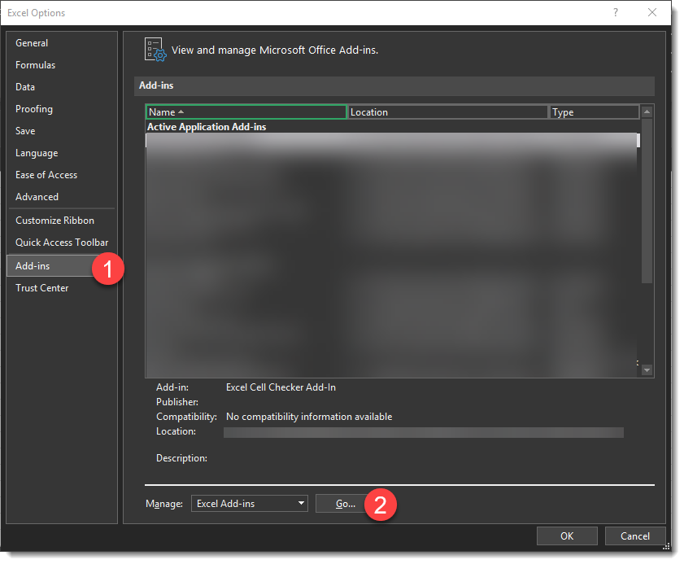
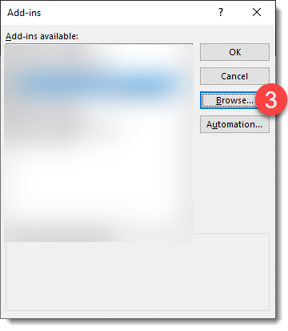
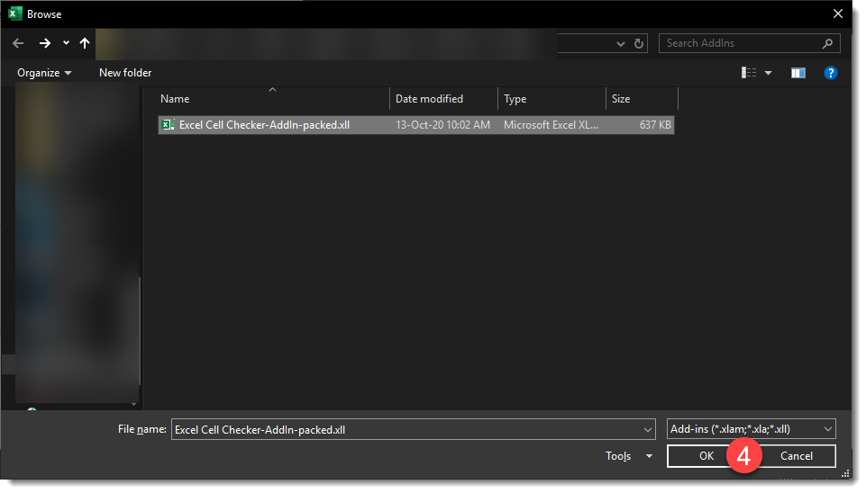
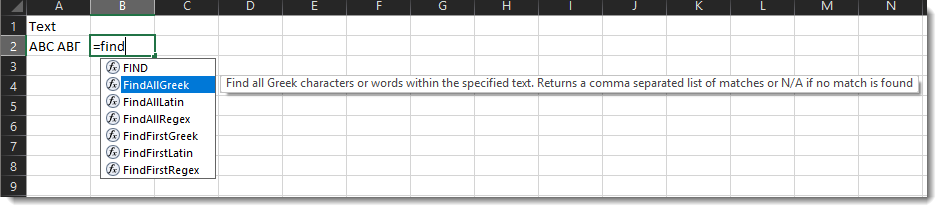

# Excel-Cell-Checker
A few quick User Defined functions to bring the power of Regular Expressions to detect rogue text and characters in Excel.
The primary goal of the project was to help detect the presence of Greek characters in Latin text and vice versa in an easy and user friendly way

We begin this project with a few simple functions:
1. FindFirstLatin - The first match of a group of Latin characters (words) found within the selected (assumed Greek) text.
2. FindFirstGreek - The first match of a group of Greek characters (words) found within the selected (assumed Latin) text.
3. FindFirstRegex - The first match of the supplied .NET compatible Regular Expression pattern within the selected text.
4. FindAllLatin - Returns a comma separated list of Latin characters (words) within the selected text.
5. FindAllGreek - Returns a comma separated list of Greek characters (words) within the selected text.
6. FindAllRegex - Returns a comma separated list of all matches of the supplied .NET compatible Regular Expression pattern within the selected text.

## Installation
1. Download the correct version for your version of Excel from the <a href="https://github.com/inamesh/Excel-Cell-Checker/releases" target="_blank">releases</a> page:
    * Excel 32-bit: Excel.Cell.Checker-AddIn-packed.xll
    * Excel 64-bit: Excel.Cell.Checker-AddIn64-packed.xll

2. In Excel, go to File > Options and follow the steps below to install the AddIn.

    Click on "Add-ins" and make sure "Excel Add-ins" is selected in the "Manage" list and click Go. 

    In the box that appears, click Browse

    Locate the file you downloaded in Step and and click OK.

    
    That's It! You can now use the functions in Excel

 
    
## Note on Regular Expressions
The FindFirstRegex and FindAllRegex functions are meant to be used with <a href="https://docs.microsoft.com/en-us/dotnet/standard/base-types/regular-expressions" target="_blank">.NET compatible regular expressions</a> including Exclusion groups! Special features of other Regex parsers will not work and might generate errors.
